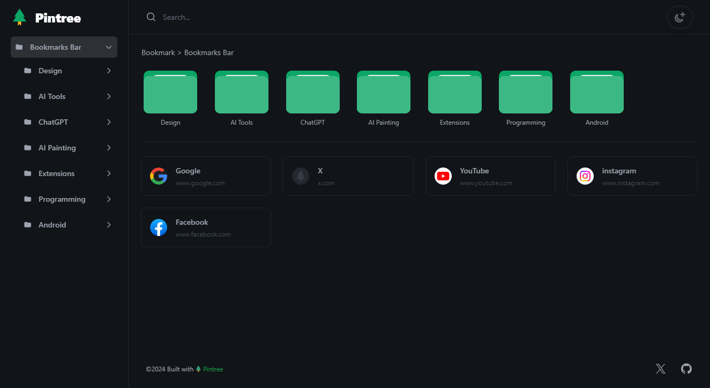
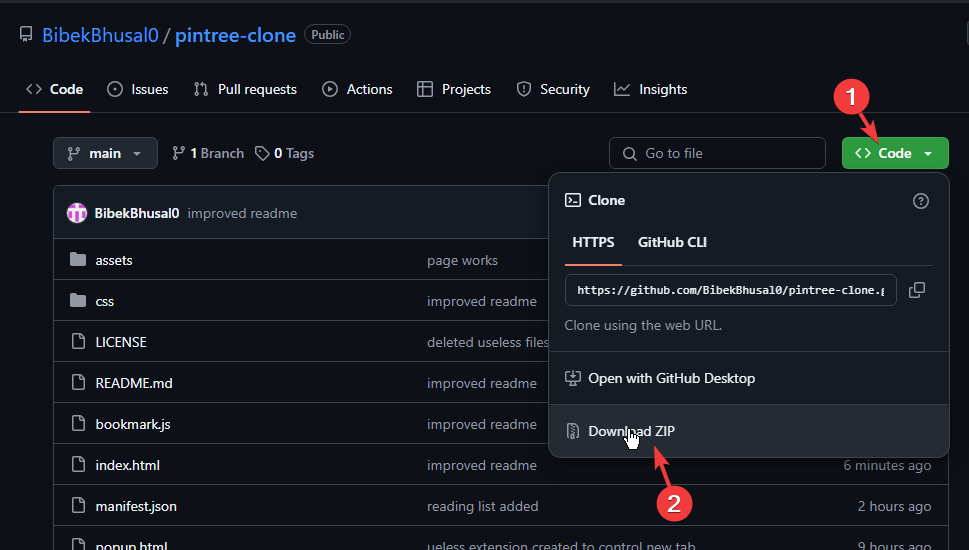
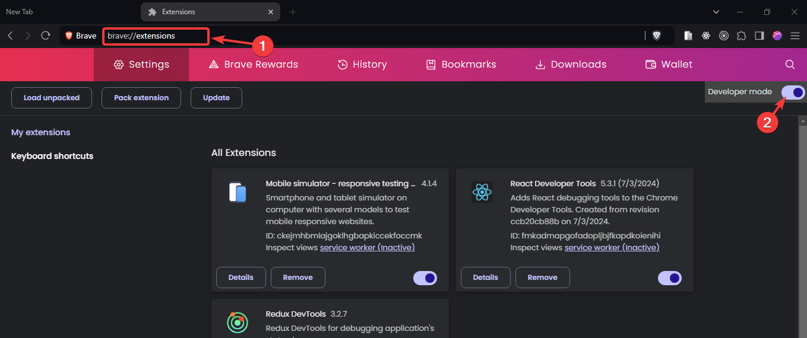
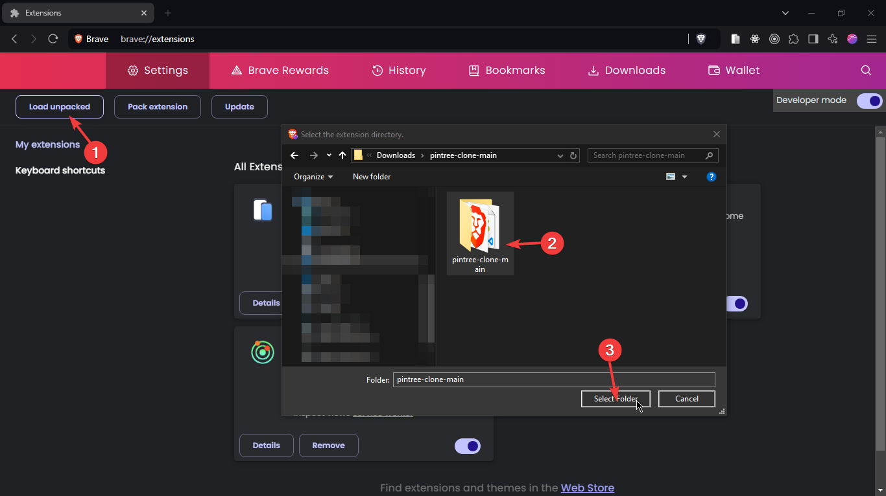

# Pintree Chrome Extension

Based on [Pintree](https://pintree.io/)

## What is pintree

Pintree is an open-source project that aims to convert browser bookmarks into a navigation website. With just a few simple steps, you can transform your bookmarks into a beautiful and user-friendly navigation page.

This defination is from [Pintree GitHub](https://github.com/Pintree-io/pintree).

### Pintree Demo

Demo screenshot from [app.pintree](https://app.pintree.io/)

## What is pintree chrome extension

The Pintree Chrome Extension is a streamlined version of the Pintree project, designed specifically to enhance the way users manage their bookmarks directly within the browser. By leveraging the functionality of the original Pintree, this extension allows users to quickly convert their browser bookmarks into a visually appealing navigation website with minimal effort.

Pintree looks just like demo above but it is in New tab page.

## Features of Pintree

Bookmark Exporting: Allows users to export browser bookmarks easily through the Pintree Bookmarks Exporter extension.

JSON Format Conversion: Converts bookmark files into JSON format for simplified processing and integration.

User-Friendly Interface: Easily navigate and manage your bookmarks.

Search Functionality: Quickly find your bookmarks with a built-in search feature.

## Advantages Over Pintree

The extension eliminates the need for multiple steps involved in setting up Pintree, such as exporting bookmarks, cloning the repository, modifying the JSON file, and hosting it.

The Pintree Chrome Extension is ideal for users who prefer not to share their bookmarks but still wish to create a visually appealing navigation page for their bookmarks. This makes it a great tool for organizing and accessing your bookmarks in a more engaging and user-friendly way.

## Installation

### Step 1: Download the GitHub Repository

Clone the repository or download the ZIP file from GitHub.


### Step 2: Open Your Browser And Enable Developer Mode

Go to extension settings with given URL.

**Chrome** : `chrome://extensions`

**Egde** : `edge://extensions`

**Brave** : `brave://extensions`

**Vivaldi** : `vivaldi://extensions`

Toggle the “Developer mode” switch in the top right corner of the page.


Screenshot show instruction for brave it is similar to other browsers.

Note that any chromium based browser will redirect to extension page when you go to `chrome://extensions`

### Step 3: Load the Extension

Click on “Load unpacked” and select the zip folder where you extracted the Pintree extension files.

Screenshot show instruction for brave it is similar to other browsers.

## More changes you can make

### If you don't want to change new tab you can change bookmarks page

1. Change manifest.json file

```diff
    ...
  "chrome_url_overrides": {
-    "newtab": "index.html"
+    "bookmarks": "index.html"
  },
  "permissions": ["bookmarks", "favicon", "readingList", "tabs"]

```

2. Change popup.js file

```diff
-   const url = "chrome://newtab";
+   const url = "chrome://bookmarks";

    const openLink = () => {
        chrome.tabs.create({ url });
    };

    document.querySelector("button").addEventListener("click", openLink);
```

this will not change new tab but instead change chrome://bookmarks page

### You can remove reading list to be included in folders

```diff
    const getBookmarks = async () => {
      const allBookmarks = await chrome.bookmarks.getTree();
-      const readingList = await chrome.readingList.query({});
-      if (readingList) {
-        if (readingList.length > 0) {
-          allBookmarks[0].children.push({
-            title: "Reading List",
-            children: readingList,
-          });
-        }
-      }
      return allBookmarks;
    };

```

## Acknowledgements

- [Pintree](https://github.com/Pintree-io/pintree).
